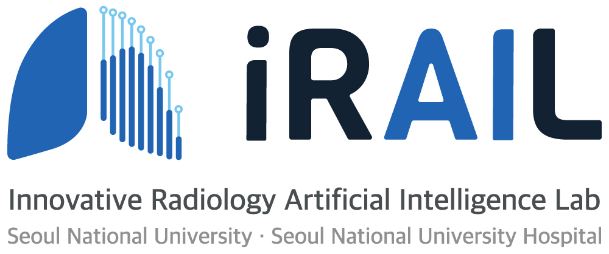

# iRAIL @ SNU, SNUH

([iRAIL](http://irail.snu.ac.kr/))
([SNU](https://en.snu.ac.kr/index.html))
([SNUH](http://www.snuh.org/global/en/main.do))

> [Recruitment / 모집요강](https://github.com/iRAIL-SNU/Main/blob/main/recruit/2022_recruit.md)  
> We are currently recruiting **graduate students** and **internship researchers**.  
> 현재 2022년도 **대학원생**과 **인턴연수생** 모집이 열려있습니다.

Our mission of the **innovative Radiology AI Laboratory (iRAIL)** is to improve diagnostic accuracy, health outcomes of diseased patients and finally enhance the health condition of global people through AI technology. 
Our main research topics include the development/validation and clinical application of AI technology for radiology imaging.

**iRAIL**은 인류 건강 증진에 기여하는 것을 목표로 서울대병원의 임상의사 및 의과학연구자와 서울대 공대의 AI엔지니어로 이루어진 의료영상인공지능 연구실입니다. 딥러닝 기반의 흉부 X-ray 진단 연구를 세계 최초로 수행하여 세계 최대 규모 학회인 RSNA 2016에서 발표하였고, 200여편의 SCI 논문과 40여건의 특허 및 기술이전 실적을 보유하고 있으며, 다양한 공학 연구진 및 기업들과 협력 연구를 진행하고 있습니다. 특히 폐암(암 사망률 1위)과 결핵(감염성 질병 사망률 1위) 등 인류 건강을 위협하는 주요 흉부 질환을 극복하기 다양한 연구를 수행하고 있습니다.

## Reasearch interests

- 딥러닝을 이용한 폐결절 분류 및 폐암 진단 시스템 개발
- 흉부 CT에서 전이암 detection 시스템 개발
- 인공지능을 활용한 저선량 X-ray 영상시스템 개발
- X-ray / CT 영상 기반 진단보조 인공지능 개발
- 의료영상 인공지능의 성능검증을 위한 임상연구 플랫폼
- 의료기기탑재형 AI기반 영상분석 솔루션 개발
- 인공지능학습용 데이터셋 구축 / 데이터 레이블러 개발 및 고도화
- 생성모델을 사용한 Anomaly detection 기반의 설명가능한 흉부 X-ray 주요질환 모델 개발
- 합성 응급영상 생성을 위한 데이터셋 구축 및 유효성 평가
- 흉부 X-ray 및 판독문 기반 Vision-Language Multi-modal 연구

## Recent publications
([Selected papers](https://github.com/iRAIL-SNU/Main/blob/main/papers/papers.md))
### - 2022
...