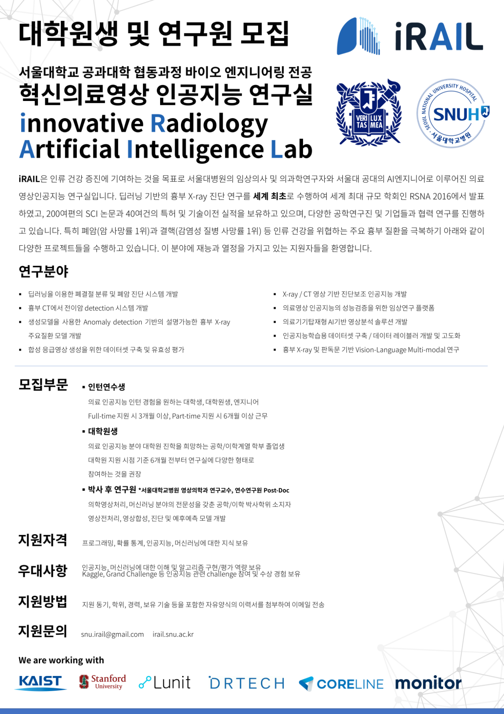

# 모집부문

## 인턴연수생

  의료 인공지능 인턴 경험을 원하는 대학생, 대학원생, 엔지니어

  Full-time 지원 시 3개월 이상, Part-time 지원 시 6개월 이상 근무

## 대학원생

  의료 인공지능 분야 대학원 진학을 희망하는 공학/이학계열 학부 졸업생

  대학원 지원 시점 기준 6개월 전부터 연구실에 다양한 형태로 참여하는 것을 권장

# 지원자격

프로그래밍, 확률 통계, 인공지능, 머신러닝에 대한 지식 보유

 

# 우대사항

인공지능, 머신러닝에 대한 이해 및 알고리즘 구현/평가 역량 보유

Kaggle, Grand Challenge 등 인공지능 관련 challenge 참여 및 수상 경험 보유

# 지원방법

지원 동기, 학위, 경력, 보유 기술 등을 포함한 자유양식의 이력서를 첨부하여 이메일 전송

# 문의

snu.irail@gmail.com